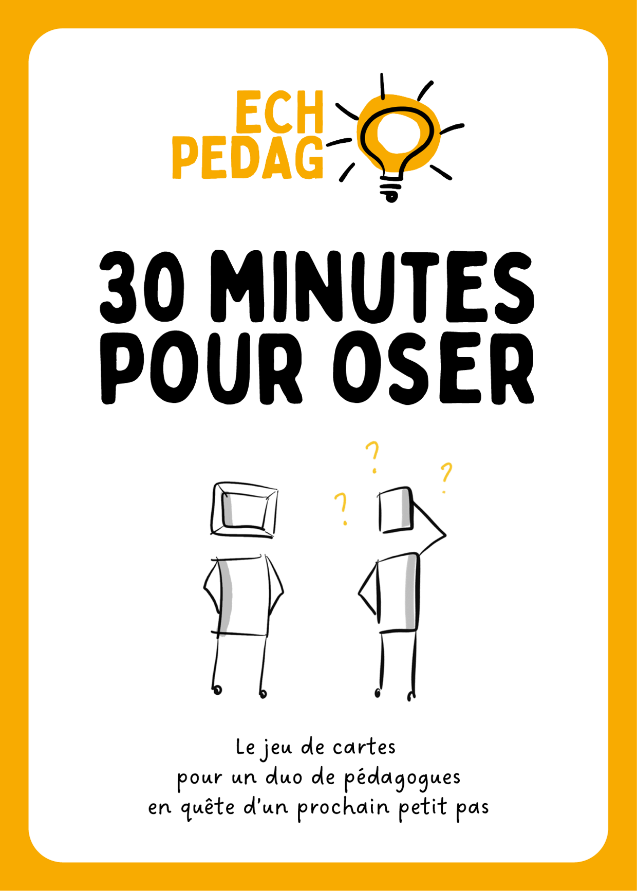

30 minutes pour oser, c'est une version rapide et ludique d'Écho pédago, qui se joue avec un jeu de cartes.

Vous pouvez trouvez sur cette page l'ensemble des supports téléchargeables et des guides de jeu pour imprimer vos cartes, et vous lancer dans l'aventure !

 

<a href="https://github.com/EchoPedago/echo-pedago/blob/main/images/regles_v2.pdf" target="_blank" >Regle du jeu de cartes IA - Orléans</a> 